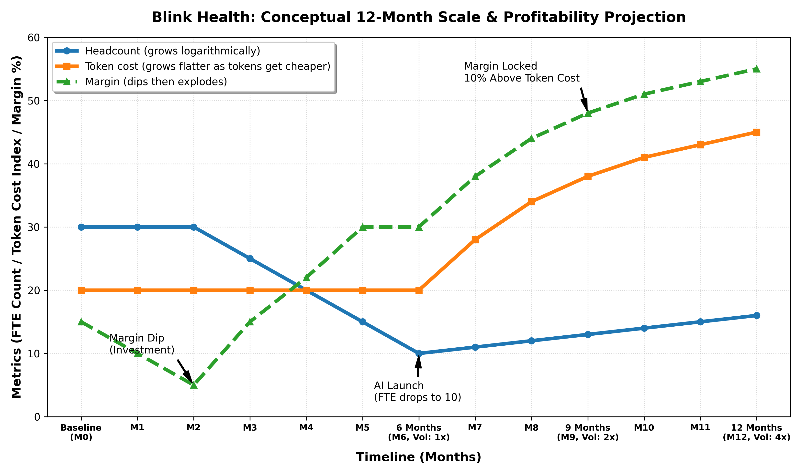

# Idea Formation: Top-Down Analysis

## 1. The one true goal

**North star goal** - Scale prescription volume without linear headcount growth.

We will achieve our goal if:
1. We get more patients to successfully start therapy without manually scaling headcount.

To do this we have to:
1. Reduce delays in the process.
2. Heavily leverage AI to scale.
3. Maintain compliance - the business does not exist without this!

We will do this by:
1. Heavily leveraging AI to solve problems across the Pharmacy Operations Hub as the current technology is perfectly suited for the task.

## 2. The Core Bottleneck: Human Throughput
* **The Constraint:** The entire system is bounded by human cognitive load.

| # | Problem | Human Bottleneck |
| :--- | :--- | :--- |
| 1 | **Manual Exception Handling** | Humans act as routing engines. |
| 2 | **Reactive Communication** | Humans act as alert systems. |
| 3 | **Tribal Knowledge** | Humans act as unstructured databases. |
| 4 | **Repetitive Work** | Humans act as execution scripts. |

## 3. The "Infinite Intern" Test
* If a problem can be solved by throwing an infinite number of interns at it, it is a throughput bottleneck, not a complex clinical issue.

```text
======================================================================================================================================================
                                                   PRESCRIPTION JOURNEY: PROCESS MAP & USER MATRIX
======================================================================================================================================================

  +----------------------+     +----------------------+     +----------------------+     +----------------------+     +----------------------+     +----------------------+     +----------------------+
  |                      |     |  2. INSURANCE &      |     |  3. PRIOR            |     |  4. PRESCRIPTION     |     |  5. PATIENT COMMS &  |     |  6. REFILL           |     |  7. RENEWAL          |
  |      1. INTAKE       | --> |     BENEFITS         | --> |     AUTHORIZATION    | --> |     ROUTING &        | --> |     FOLLOW-UP        | --> |     WORKFLOW         | --> |     WORKFLOW         |
  |                      |     |     VERIFICATION     |     |     (PA) SUPPORT     |     |     FULFILLMENT      |     |                      |     |                      |     |                      |
  +----------------------+     +----------------------+     +----------------------+     +----------------------+     +----------------------+     +----------------------+     +----------------------+
             |                             |                             |                             |                             |                             |                             |
             v                             v                             v                             v                             v                             v                             v
   [  ~30% DROP-OFF   ]         [  ~20% DROP-OFF   ]         [  ~20% DROP-OFF   ]         [  ~10% DROP-OFF   ]         [  ~10% DROP-OFF   ]         [       N/A        ]         [   ~5% DROP-OFF   ]
             |                             |                             |                             |                             |                             |                             |
             v                             v                             v                             v                             v                             v                             v
+------------------------+   +------------------------+   +------------------------+   +------------------------+   +------------------------+   +------------------------+   +------------------------+
| PROBLEMS               |   | PROBLEMS               |   | PROBLEMS               |   | PROBLEMS               |   | PROBLEMS               |   | PROBLEMS               |   | PROBLEMS               |
| - Missing patient info |   | - Benefits verification|   | - High manual work to  |   | - Suboptimal queue     |   | - Outreach only occurs |   | - Patient comms        |   | - Same as a new        |
| - Illegible faxes      |   |   failures             |   |   initiate PAs         |   |   prioritization       |   |   after a delay occurs |   |   breakdowns           |   |   prescription         |
| - Manual data entry    |   | - Delayed insurer      |   | - Lack of standardized |   | - Routing errors based |   | - Repetitive manual    |   | - Stock availability   |   |   from Step 2          |
|   errors & bottlenecks |   |   response times       |   |   clinical rationale   |   |   on network rules     |   |   status update calls  |   |                        |   |                        |
| - Unstructured data    |   | - Complex plan rules   |   | - Long patient wait    |   | - Manual Rx transfers  |   | - High patient drop-off|   |                        |   |                        |
|   from prescribers     |   |   causing exceptions   |   |   times for approvals  |   |   between pharmacies   |   |   due to confusion     |   |                        |   |                        |
+------------------------+   +------------------------+   +------------------------+   +------------------------+   +------------------------+   +------------------------+   +------------------------+
             |                             |                             |                             |                             |                             |                             |
             v                             v                             v                             v                             v                             v                             v
+------------------------+   +------------------------+   +------------------------+   +------------------------+   +------------------------+   +------------------------+   +------------------------+
| WHY THEY OCCUR         |   | WHY THEY OCCUR         |   | WHY THEY OCCUR         |   | WHY THEY OCCUR         |   | WHY THEY OCCUR         |   | WHY THEY OCCUR         |   | WHY THEY OCCUR         |
| - Prescriber EHRs      |   | - Fragmented payer     |   | - Clinical criteria    |   | - Inventory feeds      |   | - Proactive manual     |   | - Reactive tracking    |   | - Same as a new        |
|   are unstructured     |   |   systems lack APIs    |   |   requires human       |   |   are asynchronous     |   |   follow-up is         |   |   relies on patient    |   |   prescription         |
| - Fax is still the     |   |                        |   |   judgment             |   | - Pharmacy network     |   |   unscalable           |   |   to initiate          |   |   from Step 2          |
|   medical standard     |   |                        |   | - Insurer rule changes |   |   rules conflict       |   |                        |   | - Supply chains vary   |   |                        |
|                        |   |                        |   |   are undocumented     |   |                        |   |                        |   |                        |   |                        |
|                        |   |                        |   | - EHRs make it         |   |                        |   |                        |   |                        |   |                        |
|                        |   |                        |   |   extremely difficult  |   |                        |   |                        |   |                        |   |                        |
|                        |   |                        |   |   to access data       |   |                        |   |                        |   |                        |   |                        |
+------------------------+   +------------------------+   +------------------------+   +------------------------+   +------------------------+   +------------------------+   +------------------------+
             |                             |                             |                             |                             |                             |                             |
             v                             v                             v                             v                             v                             v                             v
+------------------------+   +------------------------+   +------------------------+   +------------------------+   +------------------------+   +------------------------+   +------------------------+
| USERS INVOLVED         |   | USERS INVOLVED         |   | USERS INVOLVED         |   | USERS INVOLVED         |   | USERS INVOLVED         |   | USERS INVOLVED         |   | USERS INVOLVED         |
| - Patients [Ext]       |   | - Ops Agents [Int]     |   | - Ops Agents [Int]     |   | - Pharmacists [Int]    |   | - Support Teams [Int]  |   | - Support Teams [Int]  |   | - Support Teams [Int]  |
| - Support Teams [Int]  |   | - Support Teams [Int]  |   | - Support Teams [Int]  |   | - Ops Agents [Int]     |   | - Patients [Ext]       |   | - Pharmacists [Int]    |   | - Pharmacists [Int]    |
| - Prescriber Staff[Ext]|   | - Managers [Int]       |   | - Prescriber Staff[Ext]|   | - Patients [Ext]       |   | - Prescriber Staff[Ext]|   | - Patients [Ext]       |   | - Patients [Ext]       |
|                        |   |                        |   | - Patients [Ext]       |   |                        |   |                        |   |                        |   | - Prescriber Staff[Ext]|
+------------------------+   +------------------------+   +------------------------+   +------------------------+   +------------------------+   +------------------------+   +------------------------+
```

## 4. Aligning to the incentives
"Show me the incentive and I will show you the outcome" - Charlie Munger

Leverage parties whose incentives are aligned with our success.

| Party | Incentive | Problem | Solution |
| :--- | :--- | :--- | :--- |
| Patients | Aligned - highly incentivized | Can't do anything but wait | Get them actively involved |
| Prescribers | Aligned - neutral | Want to do it but don't have enough time to deal with it | Move from active involvement to sign-off |
| Payers | Misaligned - negative incentives | Patient satisfaction and business profits are inversely proportional | Monitor |

## 5. Product Strategy
* **Leverage incentivized parties to achieve hands-off automation with AI agents.**

**PLATFORM PRINCIPLE - EVERY USER INPUT IS ERROR**
* Humans operate at the top of their license assisting AI where it needs help.
* AI is the primary operator.
* Push the boundaries and aim for the ultimate goal; do not add artificial limitations.

## 6. Metrics

### Success Metrics

```text
[ NORTH STAR METRIC ]
                            Cost per Successful Therapy Start
                                            |
         +----------------------------------+----------------------------------+
         |                                  |                                  |
[ D1: AUTONOMOUS ROUTING ]       [ D2: PROACTIVE OUTREACH ]         [ D3: KNOWLEDGE COPILOT ]
         |                                  |                                  |
=================== WHAT WE ENGINEER & OPTIMIZE (DIRECT SYSTEM INPUTS) ==========================
         |                                  |                                  |
 [ Agentic Resolution Rate ]      [ Predictive Intercept Rate ]     [ Context Retrieval Accuracy ]
 (% of exceptions cleared         (% of delayed patients            (Relevance of tribal knowledge
  by AI without humans)            updated before they ask)          surfaced to the agent)
         |                                  |                                  |
=================== WHAT WE OBSERVE (LEADING / SYSTEM HEALTH INDICATORS) ========================
         |                                  |                                  |
         +--> Manual Queue Vol              +--> Inbound Support Calls        +--> Avg Handle Time (AHT)
         |                                  |                                  |
         +--> Queue Dwell Time              +--> User Response/Action Rate    +--> Copilot Acceptance Rate
         |                                  |                                  |
         +--> AI Misroute Rate              +--> Comm Opt-Out Rate            +--> Human Override/Edit Rate
              (Guardrail)                        (Guardrail)                       (Guardrail)
```

### Guardrail Metrics
* **0 HIPAA/Compliance Violations.**
* **0 PII data stored in logs.**
* **0 PII data leakage in outbound engine.**

## 7. The AI Platform Pitch
* **Why AI?** - **If a problem can be solved with "infinite interns", you can create SOPs for them. If you can create SOPs you can use infinite AI Agents to solve the same problem.**
* Our operational bottlenecks are fundamentally linguistic and pattern-matching issues—not clinical ones. Large Language Models and predictive ML are perfectly suited to parse unstructured faxes, retrieve context from internal playbooks, draft communications, and dynamically route work, replacing the need for "infinite interns" and freeing human capital for complex edge-cases.

**To reiterate: the core Platform principal is - EVERY USER INPUT IS ERROR**
* Humans operate at the top of their license assisting AI where it needs help.
* AI is the primary operator.
* Push the boundaries and aim for the ultimate goal; do not add artificial limitations.

**Platform Goals:**
1. **Solve core issues at the source:** Automatically resolve data exceptions and operational friction before they require human intervention.
2. **Self-improve to capture tribal knowledge:** Build a continuous learning loop from operator overrides to digitize and scale team expertise.
3. **Maintain strict compliance and safety:** Enforce data security, HIPAA compliance, and clinical safety safeguards as a zero-tolerance baseline.

```text
======================================================================================================================================================
                                                   THE AI OPERATIONAL SOLUTION PLATFORM
======================================================================================================================================================

  [ 1. INTAKE ] ------------> [ 2. INSURANCE ] -------------> [ 3. PRIOR AUTH ] ----------> [ 4. RX ROUTING ] ----------> [ 5. PATIENT COMMS ] ---------> [ 6. REFILLS ] ----------> [ 7. RENEWALS ]
        |                            |                              |                             |                             |                            |                            |
        v                            v                              v                             v                             v                            v                            v
+------------------------+   +------------------------+   +------------------------+   +------------------------+   +------------------------+   +------------------------+   +------------------------+
| AI: INTAKE             |   | AI: INSURANCE          |   | AI: PRIOR AUTH         |   | AI: RX ROUTING         |   | AI: PATIENT COMMS      |   | AI: REFILLS            |   | AI: RENEWALS           |
| - AI compiles data     |   | - Integrate with third |   | - AI reads EHR data or |   | - If we fix other      |   | - AI proactively       |   | - If we solve other    |   | - AI proactively       |
|   from multiple        |   |   party eligibility    |   |   faxed history        |   |   problems             |   |   calls/texts patients |   |   problems then        |   |   reaches prescribers  |
|   unstructured and     |   |   check services       |   | - AI proactively       |   |   prioritization       |   |   to keep them in the  |   |   predicting refills   |   |   and patients to get  |
|   messy sources        |   | - AI reaches out to    |   |   reaches both patient |   |   should be a simple   |   |   loop based on event  |   |   should be straight   |   |   a new script and     |
| - AI out-reach to      |   |   patients if          |   |   and prescribers      |   |   sorting problem      |   |   triggers             |   |   forward              |   |   auto process it      |
|   patients for         |   |   eligibility check    |   | - AI constantly        |   | - Routing is a whole   |   |                        |   |                        |   |                        |
|   gathering missing    |   |   fails                |   |   monitors policy      |   |   different beast      |   |                        |   |                        |   |                        |
|   data                 |   |                        |   | - AI prepares PA       |   |   that needs separate  |   |                        |   |                        |   |                        |
|                        |   |                        |   |   Bundle for sign-off  |   |   tackling             |   |                        |   |                        |   |                        |
+------------------------+   +------------------------+   +------------------------+   +------------------------+   +------------------------+   +------------------------+   +------------------------+
```

## 8. AI Initiatives

| Priority | AI Initiatives | Priority Reason | Problem It Solves | Process Steps It Impacts | Operational Milestone (Success Looks Like) |
| :---: | :--- | :--- | :--- | :--- | :--- |
| **P0** | **AI Intake** | Intake is the source of the problem; impacts all types of prescriptions. | - Messy faxes<br>- Manual data entry<br>- Messy medical records | - Step 1 (Intake)<br>- Step 3 (Prior Auth) | - 30% reduction in intake exceptions.<br>- 85% of incoming faxes auto-transcribed and structured with zero human keying. |
| **P0** | **Payer API Hub** | Impacts all prescriptions. | - Manual benefits checks<br>- Hidden insurance rule changes | - Step 2 (Insurance)<br>- Step 3 (Prior Auth) | - 60% reduction in manual benefits verification backlog.<br>- 95% instant-match rate on third-party eligibility check APIs. |
| **P0** | **Patient Outreach** | Impacts most steps in the process; highest % drop-off. | - Missing demographic info<br>- Failed insurance checks<br>- Manual follow-ups<br>- Patient drop-off | - Step 1 (Intake)<br>- Step 2 (Insurance)<br>- Step 3 (Prior Auth)<br>- Step 5 (Comms)<br>- Step 7 (Renewals) | - 80% automated resolution rate on missing patient data.<br>- Patient speed-to-therapy (Time to Fill) improved by 1.5 days. |
| **P1** | **Prescriber Outreach** | Required for a smaller subset of prescriptions. | - MD response delays<br>- Manual script requests<br>- Manual PA preparation | - Step 3 (Prior Auth)<br>- Step 7 (Renewals) | - 40% increase in auto-renewal conversion rate.<br>- Average prescriber response cycle time reduced by 48 hours. |
| **P1** | **Smart payer policy monitor** | Required for a smaller subset of prescriptions. | - Unannounced medical policy updates<br>- Complex formulary rule changes | - Step 3 (Prior Auth) | - 100% of payer formulary rule changes ingested in under 24 hours.<br>- 95% reduction in manual payer lookup audit errors. |
| **P2** | **Prior auth reasoning engine** | Required for a smaller subset of prescriptions. | - Unstructured clinical histories<br>- Manual compilation of PA bundles | - Step 3 (Prior Auth) | - Average Prior Auth preparation time cut from 45 minutes to under 5 minutes.<br>- 90% reduction in manual clinical compilation effort. |
| **P2** | **Refill Predictor** | Impacts only downstream refill workflows. | - Inventory stockouts<br>- Manual refill checks | - Step 6 (Refills) | - 95% reduction in inventory-driven stockout occurrences.<br>- 3x increase in prescription volume processed per human operator. |
| **P2** | **Sorting Router** | Impacts only downstream routing workflows. | - Unprioritized queues<br>- Manual backlog sorting | - Step 4 (Routing) | - 100% elimination of manual exception sorting hours.<br>- 2x higher exception-handling output rate per operator hour. |

## 9. Step-by-Step AI Success Operational Metrics

| Step | Process Name | Target AI Success Operational Metric | Baseline vs. Target Scale Impact |
| :---: | :--- | :--- | :--- |
| **1** | **Intake** | - **85%** of incoming faxes auto-transcribed and structured. | - **3x increase** in prescription volume processed per operator. |
| **2** | **Insurance** | - **95%** instant benefits eligibility match API rates. | - **60% reduction** in manual benefits verification backlog. |
| **3** | **Prior Auth** | - PA preparation time cut from **45 to under 5 mins**. | - **90% reduction** in manual clinical compilation effort. |
| **4** | **Rx Routing** | - **100%** elimination of manual exception sorting hours. | - **2x higher** exception-handling output rate per operator hour. |
| **5** | **Patient Comms**| - **80%** automated resolution rate on missing patient data. | - Patient speed-to-therapy (Time to Fill) improved by **1.5 days**. |
| **6** | **Refills** | - **95%** reduction in inventory-driven stockouts. | - Refill checking manual effort **reduced by 90%**. |
| **7** | **Renewals** | - **40% increase** in auto-renewal conversion rate. | - **48-hour reduction** in average prescriber response times. |

## 10. Strategic 6-Month Roadmap

### Pillar vs. Timeline Matrix

| Pillar | Month 1 | Month 2 | Month 3 | Month 4 | Month 5 | Month 6 |
| :--- | :--- | :--- | :--- | :--- | :--- | :--- |
| **Goal** | **Setup Infra** | **Setup Infra** | **Intake Beta & Benefits GA** | **Patient Outreach Beta** | **Patient GA & Prescriber Beta** | **Prescriber GA & Scale release & continued dev** |
| **Foundations** | - HIPAA compliant CI/CD (Ready) | | | | | |
| | - Logs, metrics and alerts stack | | | | | |
| | - Fax infra | | | | | |
| | - Secure Outbound Engine | - Secure Outbound Engine | | | | |
| **AI Safety** | - Guardrails and Evals | - Guardrails and Evals | | | | |
| | - Realtime Hallucination Detection | - Realtime Hallucination Detection | | | | |
| | | | - self-improvement loops | - self-improvement loops | - self-improvement loops | - self-improvement loops |
| **Core Applications** | - AI Intake | - AI Intake | - AI Intake Beta launch<br>(Exit: 60% resolution, 0% token hallucination, 100% groundedness) | | | |
| | | - Benefits verification (Buy Stedi and Availity) | - Benefits verification GA launch (Buy Stedi and Availity) | | | |
| | | - Patient Outreach (Buy Retell AI) | - Patient Outreach (Buy Retell AI) | - Patient Outreach Beta launch (Buy Retell AI) | - Patient Outreach GA launch (Buy Retell AI) | |
| | | | | - Prescriber Outreach (Buy Retell AI) | - Prescriber Outreach Beta launch (Buy Retell AI) | - Prescriber Outreach GA launch (Buy Retell AI) |
| | | | | - Smart payer-policy monitor | - Smart payer-policy monitor | |
| | | | | - Prior Auth Reasoning Engine | - Prior Auth Reasoning Engine | - Prior Auth Reasoning Engine |
| **Peripheral Applications** | | | | | | - Refill predictor |
| | | | | | | - Sorting router |

## 11. Tradeoffs accepted (If push comes to shove)

If severe budget constraints force us to cut scope further, the absolute minimum non-negotiable footprint is built around three critical foundational pillars:
* **AI Safety:** Enforces the baseline zero-tolerance compliance and real-time hallucination prevention.
* **AI Intake:** The root source of all data in the platform. It cleans up incoming messy sources and faxes, preventing errors from cascading downstream.
* **Benefits Verification:**
  * *Strategic Rationale:* I would fight extremely hard to convince leadership to preserve this by presenting the massive ROI impact (reducing the benefits verification backlog by 60%) and sacrificing peripheral scope elsewhere instead. It acts as the core technical and data foundation that unlocks all subsequent downstream capabilities.

## 12. Financial Projection & Cost Optimization

### The Economic Model & Profitability Leap
The baseline cost of a human operations team is approximately **$0.85 per transaction** (all-in salary, benefits, and management overhead). 

Our strategic minimum goal is to **scale volume at the same total cost as the current human team**. As AI processing volumes rise, we hold our human headcount flat. Eventually, as models are optimized, semantic routing is deployed, and cheaper local models are fine-tuned, **operational unit costs drop exponentially, causing margins to explode**.

### Model Type Usage Guidelines
* **Heavyweight Reasoning Models (e.g., Claude Opus 4.7, GPT-5):** Reserved strictly for actual hard human-judgment tasks, clinical summarization, and parsing complex payer policies (e.g., Prior Auth Reasoning Engine).
* **Medium-Weight Models (e.g., Gemini Flash 3.5):** For standardized data parsing, document validation, and structural JSON mappings (e.g., AI Intake).
* **Specialized Small Language Models (SLMs) (e.g., fine-tuned Llama 4-8B):** For narrow, templated workflows and repetitive text generation (e.g., Patient Outreach SMS/Emails, automated Refill/Renewal notices).
* **Prompt Caching & Semantic Routing:** Keep guidelines and payer policy prompts cached to reduce token cost by 50%, and bypass LLMs entirely when local lookups resolve the exception.

---

### Scale vs. Profitability Graph



#### Graph Interpretation:
*   **HEADCOUNT (Logarithmic Growth):** Starts at 30 FTEs (Baseline), drops to 20 FTEs by Month 4, drops sharply to 10 FTEs at the 6-Month Mark as the AI platform goes live, and then increases logarithmically to 13 FTEs (Month 9) and 16 FTEs (Month 12)—handling a 400% volume surge with minor staff additions.
*   **TOKEN COST (Flat then Flattening Growth):** Stays completely flat at 20 for the first 6 months, and then grows with a progressively flattening slope (as unit token prices get cheaper), staying securely between the Gross Margin and the Headcount cost curves in the long run.
*   **MARGIN (Investment Dip & Parallel Growth):** Starts at 15% baseline, dips slightly in Months 1–2 as we invest in platform development, climbs back up to 30% at the 5-Month and 6-Month Marks, and then stays locked at exactly **10% above the Token Cost curve** from Month 6 through Month 12, guaranteeing safe and permanent profitability.

## 12. Leadership Executive Briefs

### AI Safety: Enforcing Structural Trust
Enforcing zero-tolerance boundaries for PII leakage, HIPAA violations, and clinical hallucinations is our absolute license to operate. To scale prescription volume without exposing the business to catastrophic regulatory or reputational collapse, we are investing early in a dedicated AI Safety layer. This system deploys real-time, deterministic guardrails that redact sensitive PII (such as SSNs, phone numbers, and clinical identifiers) at both the ingestion and outbound messaging stages, completely preventing data exposure.

By establishing these strict safety boundaries in Months 1 and 2, we insulate the business from risk while allowing our core extraction models to operate at peak autonomy. Furthermore, the deployment of continuous self-improvement loops from Month 3 onwards ensures that every operator correction is captured as high-fidelity feedback, allowing our models to safely learn and scale clinical context without compromising compliance.

### AI Intake: Clean Ingestion at the Source
Our primary operational bottleneck starts with the unstructured and highly fragmented nature of inbound prescriptions, faxes, and medical scans. Currently, our human staff spend thousands of hours acting as manual data-entry clerks just to get basic details structured. AI Intake resolves this friction by compiling and structuring data from multiple messy medical sources using localized, high-performance extraction models, automating up to 85% of transcription with zero human keying.

Structuring and validating faxes at the very start of the funnel stops exceptions before they can cascade downstream. By ensuring only pristine, structured data enters the database, we prevent up to 30% of downstream prior authorization and benefits exceptions from ever occurring, instantly tripling our processed prescription volume capacity per human operator in Month 6.

### Benefits Verification: Accelerating Time-to-Market (Buy Option)
Benefits and eligibility checks are a massive operational drain due to fragmented insurer rules and unannounced medical policy changes. Rather than expending critical, scarce engineering resources over multiple quarters to build custom clearinghouse integrations from scratch, our strategy is to **Buy and Integrate Stedi and Availity's** mature, secure benefits-verification APIs. Leveraging these established networks allows us to achieve a 95% instant-match rate on eligibility checks in Month 3.

Choosing to buy over build cuts our development timeline by at least six months and eliminates the massive regulatory friction of building custom payer clearinghouse integrations. This integration instantly reduces our manual benefits verification backlog by 60%, delivering an immediate operational return on investment and establishing the essential data foundation needed to fuel our prior authorization and automated patient communication engines.

## 13. FAQs

### A. Workflow and business impact
* **Automation of Exceptions:** AI automates repetitive administrative tasks (document parsing, outreach, and verification checks), converting unstructured exceptions into highly predictable operational flows.
* **Core Business Gains:** Increases prescription volume processed per human operator by 3x, reduces speed-to-therapy cycle times by an average of 1.5 days, and lifts overall conversion rates by preventing patient drop-offs.

### B. AI confidence and human oversight
* **Confidence-Based Routing:** AI auto-processes high-confidence outputs (>95%). Medium confidence (70-94%) pre-populates fields for operator confirmation (Level 2 Copilot). Low confidence (<70%) bypasses AI entirely to human-only queues.
* **Active Feedback Loops:** Every operator correction, approval, or override in the workspace UI is captured as a high-fidelity label, creating a continuous feedback loop to continuously fine-tune local models.

### C. Build vs. buy
* **Buy (Core Infrastructure):** Leverage established platforms for commoditized components. Buy **Stedi and Availity** for benefits verification APIs, and buy **Retell AI** for patient and prescriber outbound outreach.
* **Build (Proprietary IP):** Build the custom RAG context search, the smart prioritization queues, and the unified operator dashboard embedding real-time recommendations.

### D. Operational change management
* **Top-of-License Framing:** Position AI as an administrative copilot that eliminates "intern-level" manual typing, allowing agents and pharmacists to focus on complex, high-value problem solving.
* **Phased Cohorts:** Invite senior operators into weekly sprint reviews as co-designers, gamify error-catching audits, and roll out features starting with a single "Champion" team first to build trust.

### E. Data readiness
* **SOP Vectorization:** Aggregate unstructured wikis, standard operating procedures, and Slack resolution threads, converting them into vector embeddings for context-aware search.
* **Exception Taxonomy:** Transition from free-form text labels to a standardized categorical taxonomy to enable accurate ML routing and prioritization.

### F. Compliance and safety
* **Zero Data Retention (ZDR):** Secure enterprise agreements with LLM providers ensuring patient health data is never stored or used to train public models.
* **Deterministic Guardrails:** Run local regex and named entity recognition (NER) scrubbers to ensure 0 PII leakage in outbound logs, and hard-bar AI from clinical interaction checks or dosage alterations.

## 14. TODO:
- get real baseline data

## 15. Appendix

### AI Tools and Prompts Used
* **AI Tools:** Kilo Code with Gemini - a 24-hour interactive session totaling $30 in API costs. Python Matplotlib library for rendering the Scale vs. Profitability Chart.
* **Summarized Prompts of Discussion:**
  * *"De-noise and separate symptoms from structural failures using a Theory of Constraints (TOC) lens."*
  * *"Model headcount logarithmically and token costs linearly with a flattening concave-down curve to represent progressive pricing reductions."*
  * *"Map the 3 foundational pillars (Safety, Inflow, and Benefits) as non-negotiable tradeoffs if severe budget cuts force scope reductions."*

### What Worked
* **Iterations over one-shot generation:** Proving ideas dynamically and systematically refining table layouts, graphs, and logic structures step-by-step rather than expecting a single large output.
* **Unified Metrics Section:** Placing Success Metrics, the Profitability Graph, and Guardrail Metrics under a single "Metrics" section instantly established a rigid cause-and-effect hierarchy.
* **Refill & Renewal Separation:** Splitting Refills (internal logistics and communications) and Renewals (external prescriber outreach) as two distinct steps with their own separate drop-offs.
* **Horizontal Operational Mapping:** Creating a clean, aligned horizontal solution matrix to map our seven AI initiatives directly to their respective process steps.

### What Surprised Me & A-ha Moments
* **Honestly, nothing.** I have looked at healthcare very deeply and use the AI tools every single day. The technology behaves exactly as anticipated when applied to well-structured operational problems.